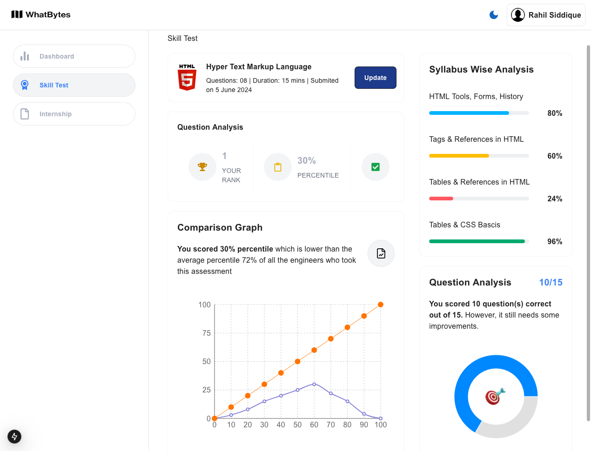
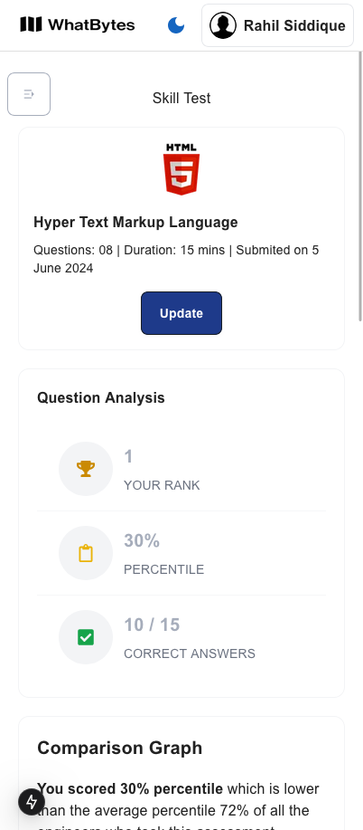
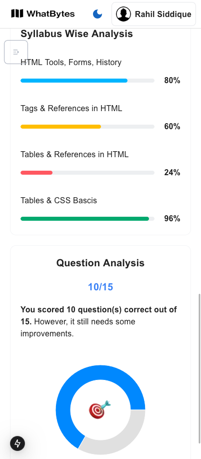

# **Frontend Developer Internship Assignment**

This project is a submission for the internship assignment as per the given requirements. It is built using **Next.js**, **TailwindCSS**, and other supporting libraries for UI and charts. The project is fully responsive and incorporates multiple modern UI components.

## **Features**

- **Responsive Design**: The layout adjusts for smaller screens, moving the "Skill-wise" and "Question Analysis" sections to the bottom.
- **Skill Analysis Chart**: Interactive and visually appealing charts built using `Recharts`.
- **Form Handling**: Integrated with `React Hook Form` for managing user inputs effectively.
- **Modern UI Components**: Styled with `TailwindCSS`, `MUI`, `DaisyUI`, and `Toolpad Core`.
- **Deployed Live**: Accessible through a live deployment link for easy access.

## **Tech Stack**

- **Framework**: [Next.js](https://nextjs.org/)
- **Styling**: [TailwindCSS](https://tailwindcss.com/), [DaisyUI](https://daisyui.com/), [MUI](https://mui.com/)
- **Charts**: [Recharts](https://recharts.org/)
- **Form Management**: [React Hook Form](https://react-hook-form.com/)

## **Screenshots**

### **Desktop View**



### **Mobile View**




## **How to Use**

Visit the live deployment link or run the project locally. Navigate through the responsive dashboard. View the analysis charts under the "Skill-wise" and "Question Analysis" sections.

## **Getting Started**

Follow these steps to set up the project locally:

### **Prerequisites**

- Node.js (v18 or later)
- npm package manager

### **Installation**

1. Clone the repository:
   ```bash
   git clone https://github.com/maasajal/what-bytes-internship.git
   ```
2. Navigate to the project directory:
   ```bash
   cd what-bytes-internship
   ```
3. Install dependencies:
   ```bash
   npm install
   ```
4. Start the development server:
   ```bash
   npm run dev
   ```
5. Open your browser and visit:
   ```bash
   http://localhost:3000
   ```

## **Deployment**

This project is deployed using Vercel.
Live URL: [What Bytes Internship assignment](https://what-bytes-internship.vercel.app)

## **Folder Structure**

The project is organized as follows:

```bash
what-bytes/
├── public/                     # Publicly accessible assets
│   ├── favicon.ico             # Favicon for the application
│   ├── fonts/                  # Custom fonts (if any)
│
├── src/                        # Source code
│   ├── app/                    # Application-specific files
│   │   ├── (dashboards)/dashboard/     # Dashboard-specific routes
│   │   │   ├── internship/             # Internship-related components
│   │   │   │   ├── page.jsx            # Internship page component
│   │   │   ├── skill-test/             # Skill-test-related components
│   │   │   │   ├── layout.jsx          # Layout file for skill test page
│   │   │   │   ├── page.jsx            # Skill test page component
│   │   │   ├── layout.jsx              # Main dashboard layout
│   │   │   ├── page.jsx                # Dashboard index page
│   │
│   │   ├── error.jsx                   # Global error handling component
│   │   ├── loading.jsx                 # Loading spinner
│   │   ├── layout.jsx                  # Global layout
│   │   ├── globals.css                 # Global styling
│
│   ├── components/                     # Reusable React components
│   │   ├── ComparisonGraph.jsx         # Comparison graph component
│   │   ├── Navbar.jsx                  # Navbar component
│   │   ├── QuestionAnalysis.jsx        # Question analysis component
│   │   ├── QuestionAnalysisProgress.jsx # Progress tracker for question analysis
│   │   ├── SkillSets.jsx               # Skill sets display component
│   │   ├── Statistics.jsx              # Statistics display component
│
│   ├── assets/                         # Static assets (images, etc.)
├── package.json      # Project metadata and dependencies
└── README.md         # Project documentation
```

## **Libraries Used**

- **Next.js**: For server-side rendering and routing.
- **TailwindCSS**: For responsive and utility-first styling.
- **MUI**: For pre-built UI components.
- **Recharts**: For creating interactive graphs and charts.
- **React Hook Form**: For managing forms and input validation.

## **Assumptions**

The design requirements have been followed to the best of my understanding. Data for charts and forms is preloaded or hardcoded for demonstration purposes.

## **Contact**

If you have any questions or require additional details, feel free to contact me:

#### **Md Abdullah All Sajal**

- **Email**: maas.sajal@gmail.com
- **LinkedIn**: https://www.linkedin.com/in/maa-sajal

## **License**

This project is for assignment purposes only and is not intended for commercial use.
